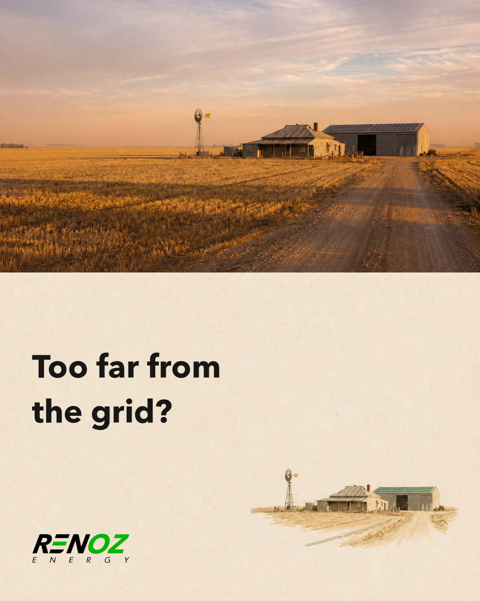
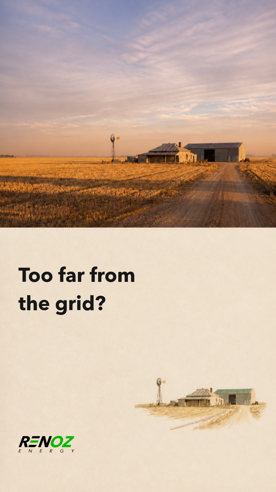
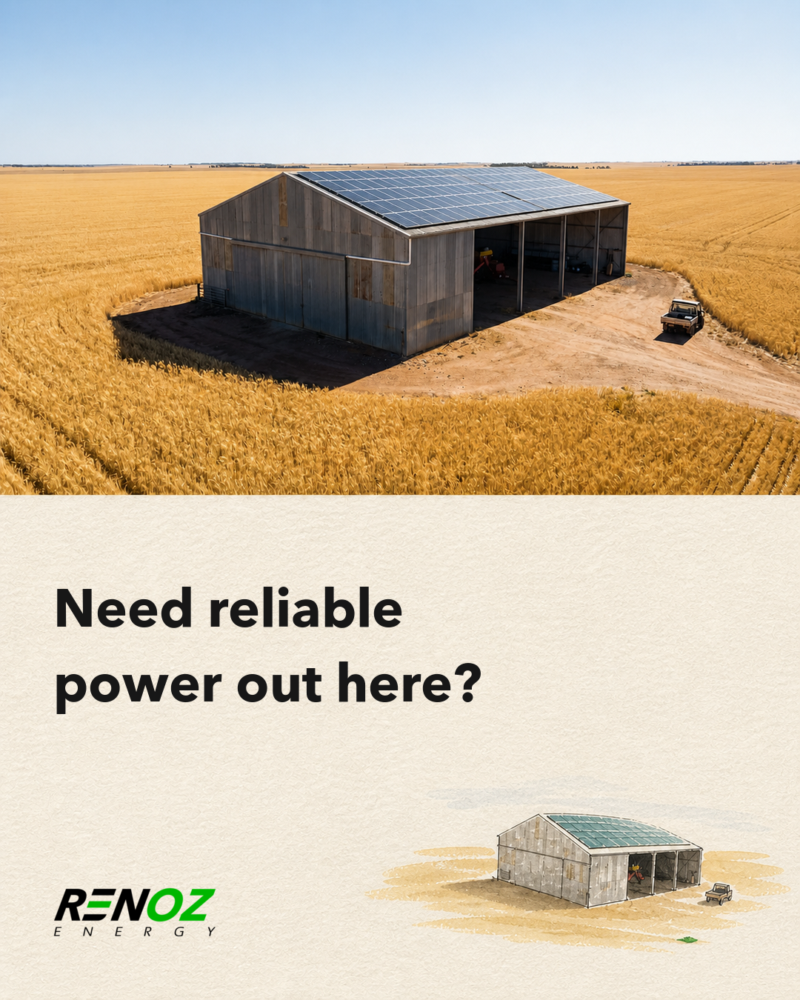
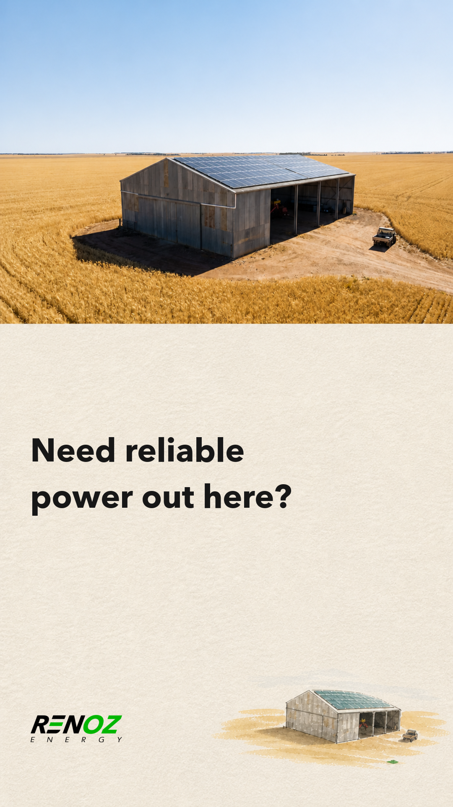

# RENOZ editorial pain test

## Too far from the grid?

### Feed

### Story / Reel

- Primary text: Planning power for a regional WA property? Tell us where you are and what you need to run. We’ll connect you with a WA off-grid installer.
- Headline: Talk to a WA off-grid installer
- Description: Tell us about the property and what you need to power.
- CTA: Contact Us
- Destination: https://renoz.energy/contact?type=off-grid
- Hypothesis: A direct remoteness question will prompt property owners already contemplating off-grid power to self-identify.

## Need reliable power out here?

### Feed

### Story / Reel

- Primary text: Planning power for a regional WA property? Tell us where you are and what you need to run. We’ll connect you with a WA off-grid installer.
- Headline: Talk to a WA off-grid installer
- Description: Tell us about the property and what you need to power.
- CTA: Contact Us
- Destination: https://renoz.energy/contact?type=off-grid
- Hypothesis: A practical power question beside a recognisable working shed will attract operators with real loads rather than general battery interest.
